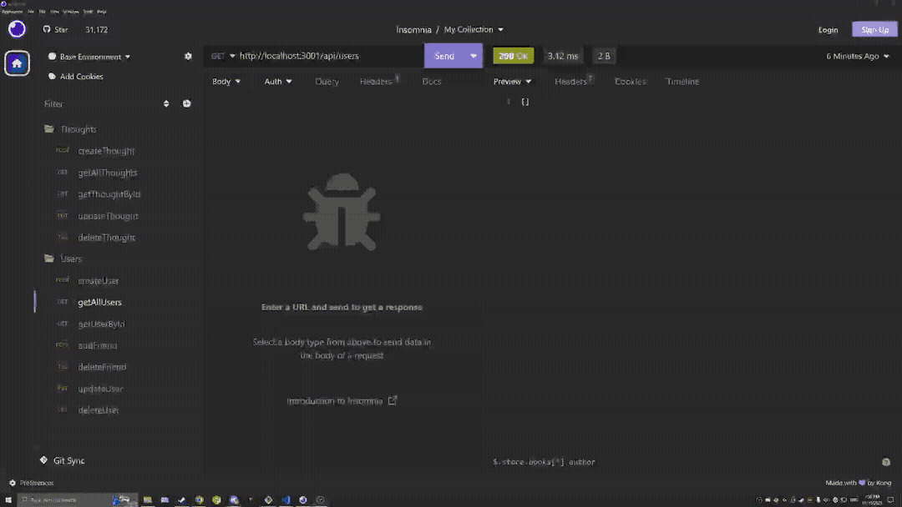

# socialLITE

## Description

A noSQL social media api using express and mongoDB.

## Table of Contents

-   [Installation](#installation)
-   [Usage](#usage)
-   [License](#license)
-   [How to Contribute](#contributing)
-   [Tests](#tests)
-   [Questions](#questions)

## Installation

Clone this repo, run npm i from the project's root directory, then run npm start.

## Usage

Make get, put, post, or delete calls to /api/users or api/thoughts. To target a specific user or thought, append the mongodb object id as a url parameter (ex: /api/thought/655ad91ea09d9105f84efb8c).

## License

This project is licenced under [MIT License](https://choosealicense.com/licenses/mit)

## Contributing

This project is not currently seeking any collaborators

## Tests

This project does not currently implement any test functionality

## Questions

If you have any questions or concerns regarding this project, [here](https://github.com/galvin-sh) is my github profile.
